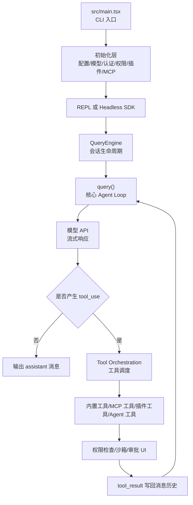

# Claude Code 源码学习导读

本文档面向想系统学习 Claude Code 源码结构、Agent 运行时、工具调用、权限治理、插件/MCP 生态和终端 UI 实现的读者。当前仓库是以 `src/` 为核心的源码快照，适合作为架构研究和源码阅读材料。

## 1. 阅读目标

学习这份源码时，不建议从具体组件或工具文件随机切入。Claude Code 的核心价值在于它把大模型对话、工具调用、权限控制、终端交互、插件扩展、MCP 连接和多 Agent 任务组织成了一个完整运行时。因此第一阶段应该先建立一张全局地图：

- CLI 启动后如何初始化运行环境
- 用户输入如何进入会话运行时
- 模型响应中的 `tool_use` 如何被执行
- 工具结果如何回到模型上下文
- 权限、沙箱、配置、插件、MCP 如何参与每一轮执行
- React + Ink 终端 UI 如何承载复杂交互
- AgentTool、Task、Worktree、Swarm 等能力如何扩展主循环

## 2. 总体架构

可以把 Claude Code 理解成一个终端里的 Agent Runtime，而不是一个简单的 API 包装器。



这条链路是源码学习的主线。后续阅读大多数模块时，都可以问一句：它是在这条链路的哪个阶段发挥作用？

## 3. 第一批必读文件

### 3.1 `src/main.tsx`

这是 CLI 总入口，也是源码里最值得先扫读的文件。它负责把各种子系统接到一起：

- 启动性能打点和若干预加载任务
- 解析命令行参数
- 初始化配置、托管设置、策略限制、用户状态和模型设置
- 初始化插件、内置 skills、MCP server、LSP、Git/worktree 状态
- 准备工具列表和 slash commands
- 选择交互模式、非交互模式、远程模式或恢复会话
- 最终进入 REPL 或 headless 查询流程

阅读建议：第一次不要试图读懂每个 import。重点找 `main()`，再观察它如何收集配置、创建运行上下文、调用渲染或查询入口。

### 3.2 `src/QueryEngine.ts`

`QueryEngine` 是会话生命周期的封装层。它把“用户提交一次消息”转化为一轮可持续的 Agent 查询。

重点关注：

- `QueryEngineConfig`
- `QueryEngine` 类
- `submitMessage()`
- `ask()`

它的职责包括：

- 保存会话消息历史
- 处理用户输入
- 构建系统提示和用户上下文
- 创建或复用 `AbortController`
- 维护文件状态缓存、权限拒绝记录、usage 统计
- 调用 `query()` 进入核心循环
- 把内部消息转成 SDK 消息或 UI 可消费消息

如果说 `main.tsx` 是启动总线，`QueryEngine.ts` 就是每段对话的驾驶舱。

### 3.3 `src/query.ts`

这是核心 Agent loop。Claude Code 之所以不是一次性问答，而是能持续调用工具、读写文件、执行命令、继续推理，关键就在这里。

重点关注：

- `QueryParams`
- `State`
- `query()`
- 模型响应流处理
- tool use 检测
- `runTools()`
- 自动 compact 和 token budget 处理
- stop hooks、post-sampling hooks、错误恢复逻辑

可以把 `query()` 理解为一个状态机：

1. 准备当前 messages、system prompt、tool context
2. 调用模型 API
3. 流式接收 assistant 内容
4. 如果没有工具调用，结束当前 turn
5. 如果有工具调用，执行工具
6. 把工具结果作为新的 user/tool_result 消息写回
7. 继续下一轮，直到达到停止条件

### 3.4 `src/Tool.ts`

这是工具系统的类型基础。它定义了工具运行时能看到什么、能修改什么，以及权限和 UI 如何接入。

重点关注：

- `ToolInputJSONSchema`
- `ValidationResult`
- `ToolPermissionContext`
- `ToolUseContext`
- `Tools`
- 工具查找与匹配相关函数

`ToolUseContext` 特别重要。它把工具执行所需的环境装进一个上下文里，包括：

- 当前可用工具和命令
- 主循环模型
- MCP clients 和 resources
- agent definitions
- app state getter/setter
- 文件状态缓存
- 权限上下文
- UI JSX 回调
- 通知能力
- abort signal

读工具实现前，先读懂 `ToolUseContext`，后面会轻松很多。

### 3.5 `src/tools.ts`

这是内置工具注册中心。它把各种工具组合成当前环境下可用的工具集合。

典型工具包括：

- `AgentTool`
- `BashTool`
- `PowerShellTool`
- `FileReadTool`
- `FileEditTool`
- `FileWriteTool`
- `GlobTool`
- `GrepTool`
- `WebFetchTool`
- `WebSearchTool`
- `TodoWriteTool`
- `TaskCreateTool`
- `TaskGetTool`
- `TaskUpdateTool`
- `TaskListTool`
- `ListMcpResourcesTool`
- `ReadMcpResourceTool`
- `SkillTool`
- `AskUserQuestionTool`
- `EnterPlanModeTool`
- `EnterWorktreeTool`

重点关注：

- `getAllBaseTools()`
- `getTools()`
- `assembleToolPool()`
- `getMergedTools()`
- feature flag 和环境变量如何影响工具可用性
- deny rules 如何过滤工具

### 3.6 `src/commands.ts`

这是 slash command 注册中心。

它聚合了大量命令，例如：

- `/help`
- `/login`
- `/logout`
- `/model`
- `/memory`
- `/mcp`
- `/permissions`
- `/review`
- `/resume`
- `/status`
- `/tasks`
- `/skills`
- `/plugin`
- `/hooks`
- `/compact`

重点关注：

- `getCommands()`
- `findCommand()`
- `getCommand()`
- `filterCommandsForRemoteMode()`
- 内置命令、skill 命令、插件命令、MCP skill 命令如何合并

## 4. 核心执行链路

### 4.1 启动阶段

启动阶段主要由 `src/main.tsx` 组织。它会加载各种全局状态，并把运行时所需的对象准备好。

典型步骤：

1. 启动 profiling 和提前预取任务
2. 读取 CLI 参数
3. 初始化配置、用户、认证、策略和远程托管设置
4. 初始化插件和内置 skills
5. 加载 MCP 配置并连接 MCP server
6. 构建命令列表和工具列表
7. 构建 app state
8. 决定进入交互 REPL、headless SDK、恢复会话或远程桥接模式

这一层关心的是“把系统组装起来”，不是具体执行每个工具。

### 4.2 输入处理阶段

用户输入进入系统后，会先经过 `QueryEngine` 和输入处理工具。

相关模块：

- `src/QueryEngine.ts`
- `src/utils/processUserInput/processUserInput.ts`
- `src/utils/messages.ts`
- `src/utils/queryContext.ts`
- `src/memdir/memdir.ts`

这一阶段会处理：

- 普通文本 prompt
- attachment
- slash command
- memory prompt
- CLAUDE.md 或项目上下文
- system prompt 拼接
- 用户上下文和系统上下文

### 4.3 模型查询阶段

核心在 `src/query.ts`。

这一阶段会：

- 计算 token budget
- 判断是否需要 compact
- 构建 API 请求
- 发起流式模型调用
- 处理 assistant 消息、thinking block、tool_use block
- 处理 API 错误和恢复策略

相关模块：

- `src/services/api/`
- `src/services/compact/`
- `src/query/tokenBudget.ts`
- `src/query/config.ts`
- `src/query/transitions.ts`

### 4.4 工具执行阶段

当模型返回 `tool_use` 后，系统进入工具调度。

关键模块：

- `src/services/tools/toolOrchestration.ts`
- `src/services/tools/StreamingToolExecutor.ts`
- `src/tools.ts`
- `src/Tool.ts`
- `src/tools/*`

工具执行通常需要经过：

1. 找到工具定义
2. 校验输入 schema
3. 检查工具是否启用
4. 检查权限
5. 执行工具
6. 产生 tool_result
7. 把结果写回消息历史

### 4.5 继续循环阶段

工具结果写回后，`query()` 会继续下一轮模型调用。模型看到工具结果后，可以继续解释、继续调用工具，或给出最终回答。

这就是 Agent loop 的基本形态：

```text
user message
  -> assistant thinking/content/tool_use
  -> tool execution
  -> user tool_result
  -> assistant next step
  -> ...
```

## 5. 工具系统学习路线

建议按风险和复杂度逐步阅读。

### 5.1 简单工具

先读这些工具，理解基本结构：

- `src/tools/FileReadTool/`
- `src/tools/GlobTool/`
- `src/tools/GrepTool/`
- `src/tools/TodoWriteTool/`

关注每个工具一般会有：

- name
- description/prompt
- input schema
- isEnabled
- validateInput
- checkPermissions
- call/execute
- result 渲染或格式化

### 5.2 文件修改工具

再读：

- `src/tools/FileEditTool/`
- `src/tools/FileWriteTool/`
- `src/tools/NotebookEditTool/`

这类工具更适合学习：

- 文件状态缓存
- diff 生成
- 写入权限
- UI 权限提示
- 防止误改危险路径
- notebook 特殊结构处理

### 5.3 Shell 工具

重点读：

- `src/tools/BashTool/`
- `src/tools/PowerShellTool/`
- `src/utils/shell/`
- `src/components/permissions/BashPermissionRequest/`
- `src/components/permissions/PowerShellPermissionRequest/`

这部分体现了 Claude Code 的安全边界：

- 命令分类
- 是否需要审批
- 命令输出如何截断和展示
- 长命令如何运行和中断
- 沙箱违规如何反馈

### 5.4 Agent 和任务工具

再读：

- `src/tools/AgentTool/`
- `src/tools/TaskCreateTool/`
- `src/tools/TaskGetTool/`
- `src/tools/TaskUpdateTool/`
- `src/tools/TaskListTool/`
- `src/tools/TaskOutputTool/`
- `src/tasks/`
- `src/utils/task/`

这部分适合研究多 Agent 和后台任务如何工程化：

- agent definition 如何加载
- 子 agent 上下文如何构建
- 工具白名单/黑名单如何限制
- task 状态如何维护
- 后台任务输出如何回到主会话

### 5.5 MCP 工具

相关目录：

- `src/services/mcp/`
- `src/tools/ListMcpResourcesTool/`
- `src/tools/ReadMcpResourceTool/`
- `src/tools/MCPTool/`
- `src/commands/mcp/`

重点理解：

- MCP server config 如何解析
- server 如何连接
- MCP tools 如何转成 Claude Code 工具
- MCP resources 如何暴露给模型
- MCP 权限和企业策略如何参与过滤

## 6. 权限与安全治理

权限系统贯穿整个工具调用流程，不是单独的装饰层。

重点目录和文件：

- `src/types/permissions.ts`
- `src/utils/permissions/`
- `src/components/permissions/`
- `src/utils/sandbox/`
- `src/tools/BashTool/`
- `src/tools/FileWriteTool/`
- `src/tools/FileEditTool/`

建议关注几个概念：

- permission mode
- always allow/deny/ask rules
- additional working directories
- bypass permissions mode
- auto mode
- dangerous permissions stripping
- sandbox adapter
- permission prompt UI

核心问题：

1. 工具如何声明自己需要什么权限？
2. 用户配置的 allow/deny/ask 规则如何生效？
3. 自动模式下如何避免危险权限扩大？
4. 后台 agent 无法显示 UI 时如何处理审批？
5. 文件路径、shell 命令、MCP 调用分别如何检查？

## 7. 终端 UI 与交互

Claude Code 使用 React + Ink 风格的终端 UI。UI 不是简单打印日志，而是承担大量交互状态。

重点目录：

- `src/components/`
- `src/ink/`
- `src/screens/`
- `src/hooks/`
- `src/keybindings/`
- `src/vim/`

建议先看：

- `src/replLauncher.tsx`
- `src/components/PromptInput/`
- `src/components/messages/`
- `src/components/permissions/`
- `src/components/tasks/`
- `src/components/shell/`
- `src/components/Spinner/`

重点问题：

- 输入框如何处理多行输入、快捷键、Vim 模式
- assistant/user/tool 消息如何渲染
- 权限弹窗如何中断或恢复主流程
- shell 输出如何折叠和展开
- task 和 agent 状态如何展示
- terminal resize、光标、颜色主题如何处理

## 8. 插件、Skills 与命令扩展

Claude Code 的扩展机制不只是在命令层增加入口，还包括 skills、插件命令、工具、hooks、MCP 等。

重点目录：

- `src/plugins/`
- `src/skills/`
- `src/utils/plugins/`
- `src/commands/plugin/`
- `src/commands/skills/`
- `src/hooks/`
- `src/utils/hooks/`

重点理解：

- 内置插件如何初始化
- 已安装插件如何发现和缓存
- 插件如何提供 commands
- 插件如何提供 skills
- skill 命令如何合并进 slash command 系统
- hooks 如何在 session、tool、compact、stop 等时机执行

## 9. 上下文、记忆与压缩

Agent 产品的难点之一是上下文管理。Claude Code 在这方面有多个层次。

相关目录：

- `src/services/compact/`
- `src/memdir/`
- `src/utils/claudemd.ts`
- `src/utils/messages.ts`
- `src/utils/tokens.ts`
- `src/query/tokenBudget.ts`
- `src/utils/tokenBudget.ts`
- `src/utils/sessionStorage.ts`

重点问题：

- 历史消息什么时候保留，什么时候压缩？
- CLAUDE.md 如何进入上下文？
- memory 如何扫描和注入？
- token budget 如何计算？
- 自动 compact 如何触发？
- 工具结果过大时如何存储和替换？

## 10. 多 Agent、Worktree 与远程能力

如果你想研究更高级的 Agent 架构，可以重点看这些模块。

### 10.1 多 Agent

- `src/tools/AgentTool/`
- `src/utils/swarm/`
- `src/utils/teammate.ts`
- `src/utils/teammateContext.ts`
- `src/utils/teamDiscovery.ts`
- `src/components/agents/`
- `src/components/teams/`

核心问题：

- 子 agent 如何创建？
- 子 agent 能访问哪些工具？
- 主 agent 如何接收子 agent 的结果？
- agent definitions 如何加载和覆盖？
- 多 agent 状态如何显示？

### 10.2 Worktree

- `src/utils/worktree.ts`
- `src/utils/worktreeModeEnabled.ts`
- `src/tools/EnterWorktreeTool/`
- `src/tools/ExitWorktreeTool/`
- `src/commands/branch/`

核心问题：

- 为什么 coding agent 需要隔离 worktree？
- 进入和退出 worktree 时如何维护状态？
- 与 Git 分支、PR、远程任务如何结合？

### 10.3 远程和桥接

- `src/bridge/`
- `src/remote/`
- `src/server/`
- `src/upstreamproxy/`
- `src/commands/desktop/`
- `src/commands/mobile/`

核心问题：

- 本地 CLI 如何被远程控制？
- session 如何桥接？
- 附件和消息如何跨边界传输？
- 权限回调如何在远程场景中处理？

## 11. 推荐阅读计划

### 第 1 天：建立主链路

阅读：

- `src/main.tsx`
- `src/QueryEngine.ts`
- `src/query.ts`

目标：

- 能说清楚一次用户输入如何变成一次或多次模型调用
- 能说清楚 tool_use 如何进入工具执行
- 能分辨 REPL、SDK/headless、query loop 的边界

### 第 2 天：读工具系统

阅读：

- `src/Tool.ts`
- `src/tools.ts`
- `src/services/tools/toolOrchestration.ts`
- `src/tools/FileReadTool/`
- `src/tools/FileEditTool/`
- `src/tools/BashTool/`

目标：

- 能说清楚一个工具的生命周期
- 能说清楚工具 schema、权限、执行、结果格式化如何配合

### 第 3 天：读权限和 UI

阅读：

- `src/utils/permissions/`
- `src/types/permissions.ts`
- `src/components/permissions/`
- `src/components/messages/`
- `src/components/PromptInput/`

目标：

- 能说清楚权限模式和审批 UI 如何保护工具调用
- 能理解终端 UI 不只是输出，而是运行时控制面板

### 第 4 天：读插件、MCP、skills

阅读：

- `src/services/mcp/`
- `src/tools/MCPTool/`
- `src/tools/ListMcpResourcesTool/`
- `src/tools/ReadMcpResourceTool/`
- `src/utils/plugins/`
- `src/skills/`
- `src/commands/plugin/`

目标：

- 能说清楚 MCP 和插件如何扩展 Claude Code 的能力边界
- 能理解 commands、skills、tools、resources 的区别

### 第 5 天：读高级 Agent 能力

阅读：

- `src/tools/AgentTool/`
- `src/tasks/`
- `src/utils/task/`
- `src/utils/swarm/`
- `src/utils/worktree.ts`
- `src/bridge/`

目标：

- 能理解多 agent、后台任务、worktree、远程桥接如何围绕主 loop 扩展

## 12. 源码阅读时的提问模板

读每个模块时，可以用下面的问题快速定位它的角色：

1. 这个模块属于启动、输入处理、模型查询、工具执行、UI、权限还是扩展系统？
2. 它的上游是谁调用它？
3. 它的下游又调用了谁？
4. 它是否修改 messages、AppState、文件系统、配置或权限状态？
5. 它是否参与模型上下文构建？
6. 它是否会影响工具可见性或工具执行结果？
7. 它是否只在特定 feature flag、平台、用户类型或模式下启用？
8. 它失败时会如何恢复或向用户展示？

## 13. 建议优先画出的几张图

后续深入学习时，可以把下面几张图补出来：

- CLI 启动序列图
- `QueryEngine.submitMessage()` 调用链
- `query()` 状态机
- tool use 到 tool result 的时序图
- permission check 决策树
- MCP server 到 MCP tool 的映射图
- plugin/skill/command 加载图
- AppState 关键字段关系图

## 14. 一句话总结

这份源码最值得学习的不是某个单点功能，而是它如何把“模型、工具、权限、上下文、UI、插件、远程、多 Agent”编织成一个可以长期运行、可审计、可扩展的终端 Agent 系统。读源码时抓住 `main.tsx -> QueryEngine.ts -> query.ts -> tools.ts/Tool.ts` 这条主线，后面的复杂模块都会变得更有坐标感。
